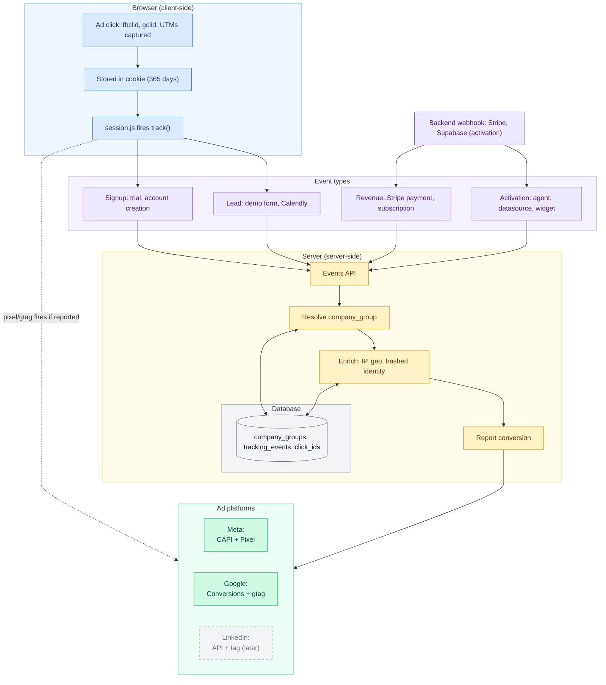

# Overview

Sleak's attribution engine tracks the complete customer journey from first ad click through signup, product usage (activation), and revenue. We use **company-level attribution** for B2B accuracy and **hybrid tracking** (server + browser) for maximum coverage & accuracy.

<br/>



<br/>

### Key principles

<CardGroup cols={2}>
  <Card title='Company-level attribution' icon='building'>
    We track companies, not individuals. Multiple employees from Acme Corp = one customer acquisition.
  </Card>
  <Card title='Strict reporting rules' icon='layers-2'>
    One lead per visitor, one signup per company. Prevents inflated conversion metrics.
  </Card>
  <Card title='Hybrid tracking' icon='git-branch'>
    Server-side for accuracy (no ad blockers), client-side for browser signals (cookies, device data).
  </Card>
  <Card title='Multi-touch attribution' icon='mouse-pointer-click'>
    We store ALL click IDs. If someone clicks Meta ad then Google ad, both platforms get attribution credit.
  </Card>
</CardGroup>

### Attribution analytics admin dashboard

The production results of the attribution engine are exposed as a queryable UI on [attribution.sleak.chat/dashboard](https://attribution.sleak.chat/dashboard). Company timelines, conversion funnels, and ad platform reporting status are all aggregated into charts and tables.

<Info>
Google Workspace OAuth via Supabase, restricted to `@sleak.chat` accounts with a membership row in the internal Sleak org. Any other host (e.g. `data.sleak.chat`) gets a bare 404 for HTML routes.
</Info>

Analyze key numbers at a glance - total leads, signups, activations, revenue, and conversion rates. Charts show daily activity trends, which ad platforms are driving results, and revenue over time.

Use the **company list** to browse all companies that have interacted with your ads. Each row shows their activity, ad platform attribution, etc.. Companies that haven't signed up yet show an "unconfirmed" badge.

Click any row in the **Company group timeline** to see their full journey - every ad they clicked, every page they visited, and every conversion event. You'll see which events were successfully reported to ad platforms, which failed, and why some weren't reported. Click any event to see the full details of what was sent to Meta or Google.

When viewing a company's timeline, filters apply to show only that company's data in the top charts.

<Tabs>
  <Tab title="Overview">
    <Frame>
      
    </Frame>
  </Tab>
  <Tab title="Timeline View">
    <Frame>
      
    </Frame>
  </Tab>
</Tabs>

---

### Event types

We track four conversion event types, each with specific business logic:

<style>
{`
table td:last-child code {
  white-space: nowrap;
}
`}
</style>

| Event Type | Event |
|------------|---------|
| **Lead** | `lead` |
| | `call_booked` |
| **Signup** | `trial_signup` |
| **Activation** | `agent_created` |
| | `datasource_created` |
| | `widget_installed` |
| **Revenue** | `customer.created` |
| | `invoice.paid` |

<Info>
**Key Distinction:** Lead and Signup events are campaign conversion goals. Activation and Revenue events enrich pixel data for algorithmic learning but don't inflate metrics.
</Info>

---

# Reporting logic deep dive

Not every event generates an ad platform conversion. Reporting rules restrict this to once per visitor (leads) and once per company (signups), keeping attribution data clean while still sending rich signals to Meta and Google's algorithms. When we do report, we credit the most recent ad click within each platform's attribution window.

### Typical user journey & attribution flow

<Steps>
  <Step title="Ad click">
    User clicks Meta ad → `fbclid` captured in URL → stored in cookie (`slk_src`, 365 days)
    
    **What's captured:**
    - Platform click ID (fbclid, gclid, msclkid)
    - UTM parameters
    - gad_source, keyword
    - Landing page URL
    - Anonymous ID (generated, 365d cookie)
  </Step>

  <Step title="Anonymous browsing">
    User browses site → no events sent, just cookies persisted
  </Step>

  <Step title="Lead submission">
    User fills demo form → Lead event fires
    
    **What happens:**
    1. Browser sends: name, email, phone, click IDs, anonymous ID
    2. Server extracts domain from email → resolves to company group
    3. Backfills: stamps company group onto earlier anonymous browsing
    4. Checks: has this `anonymous_id` reported a lead before? Does company group already have an active subscription?
    5. If first lead AND no subscription: reports to Meta/Google with enriched data  
    6. If duplicate or existing customer: stores in DB only, no ad platform report
    7. Browser fires pixels (if reported)
    
    **Company group created:**
    - Business domain (`acme.com`) → group by domain
    - Consumer domain (`gmail.com`) → group by full email (`consumer:john@gmail.com`)
  </Step>

  <Step title="Signup">
    User creates account → Signup event fires
    
    **What happens:**
    1. Backend sends: user ID, email, click IDs
    2. Server looks up member/org from user ID, resolves to company group
    3. Checks: Is user owner? First org? First signup from this company?
    4. If all yes: reports to Meta/Google
    5. If any no: stores in DB only
    6. Backfills: connects earlier lead events to this member ID
  </Step>

  <Step title="Product usage">
    User creates first agent → Activation event fires
    
    **Sent to ad platforms as micro conversions for enrichment purposes**, not counted as conversion goal
  </Step>

  <Step title="Revenue">
    Stripe webhook → Revenue event fires
    
    **Sent to ad platforms with revenue data** as micro conversions for enrichment purposes, helps optimize for value
  </Step>
</Steps>


### Company group logic

#### What is a company group?

A `company_group` is our core attribution entity. It always represents one company.

**Key concept:** Multiple organizations and users can belong to one company group.

#### Grouping rules

<Tabs>
  <Tab title="Business domains">
    <Card>
    **Rule:** Group by email domain
    
    **Example:**
    - `john@acme.com` → Company Group: `acme.com`
    - `sarah@acme.com` → Same Company Group: `acme.com`
    - `mike@techcorp.io` → Different Company Group: `techcorp.io`
    
    **Why:** Acme Corp is one customer, not three.
    </Card>
  </Tab>

  <Tab title="Consumer domains">
    <Card>
    <Info>
    We maintain a consumer domain email blacklist - these domains are **excluded from company grouping.**
    </Info>

    List of ~65 free/personal email domains sourced from the [mailchecker](https://github.com/FGRibreau/mailchecker) public list.

    Before grouping a lead or signup by email domain, we check this list first. If the domain matches, we skip domain-based grouping entirely and use the **full email address** as the grouping key instead (`consumer:{email}`) - never just the domain.

    **Rule:** Group by full email address, not domain

    **Example:**
    - `john@gmail.com` → Company Group: `consumer:john@gmail.com`
    - `sarah@gmail.com` → Different Company Group: `consumer:sarah@gmail.com`
    
    **Why:** Without this check, every Gmail/Outlook/Yahoo user in the world would get lumped into one giant fake "company" by domain. This list exists purely to prevent that - it has nothing to do with spam/quality filtering.
    </Card>
  </Tab>

  <Tab title="Organization mapping">
    <Card>
    Once a user signs up:
    - Organization ID → mapped to Company Group
    - All future events from that org → same Company Group
    - New team members joining → inherit Company Group
    
    **Attio integration (future):**
    Will use Attio's company lookup to merge duplicate groups and resolve by actual company record.
    </Card>
  </Tab>
</Tabs>

### Reporting rules

Two separate event deduplication layers exist, and they solve different problems:

- **Idempotency** (technical): every event carries an `idempotency_key`. If the exact same request arrives twice (e.g. a network retry), it's stored once and never processed again. This has nothing to do with business logic. On the client as well, the idempotency_key [ **typically the event_id** ] serves as a deduplication identifier for the ad platforms.
- **Reporting rules** (business logic): once an event is stored, we still decide *whether it counts as a reportable conversion* - once per visitor for leads, once per company for signups. This is what prevents inflated metrics, not idempotency.

  | Event Type | Reporting Rule | Purpose |
  |------------|----------------|---------|
  | **Lead** | Once per visitor AND no active subscription | Prevents duplicates from same browser + blocks existing customers (no inflated acquisition metrics) |
  | **Signup** | Once per company (owner only, first org only) | Ensures 1 customer = 1 conversion (no inflation from team growth or multi-org users) |
  | **Activation events** | Always (when org has first-time owner) | Pixel enrichment/signals only (not campaign conversion goals) |
  | **Revenue events** | Always (when org has first-time owner) | Pixel enrichment/signals only (not campaign conversion goals) |

### Signups through sales

Sales-assisted signups are subject to excemptions to preserve accurate 
attribution.

<Warning>
**Internal team members (sales, support, admin) must mark their browsers** to prevent false attribution. See setup below.
</Warning>

**One-time setup (sales, support, admin):**

Log in and visit https://attribution.sleak.chat/mark-internal-browser - **from both your office and home connections**, since each has a different public IP. This sets a browser marker and also records your public IP server-side, so you stay excluded even after clearing cookies. Re-visit if your IP changes.

<Note>
Temporary manual step - will move into a frequently-used internal app so IPs get recorded automatically.
</Note>

<Tabs>
  <Tab title="With existing lead">
    <Card>
    **Scenario:** You create a signup for someone who previously submitted a lead form.

    <Info>
    **Why mark your browser?** Prevents your own click IDs from overwriting Jane's original attribution if you recently clicked a Sleak ad.
    </Info>

    **What happens:**

    <Steps>
      <Step title="Lead submits form">
        Jane clicks Meta ad → fills demo form → `fbclid` stored in database
      </Step>
      
      <Step title="Sales rep creates signup">
        You create signup for `jane@acme.com` from your browser
      </Step>
      
      <Step title="System fetches stored clicks">
        System finds Jane's company group → retrieves original `fbclid`
      </Step>
      
      <Step title="Attribution preserved">
        Meta gets conversion credit for Jane's original ad ✅
      </Step>
    </Steps>
    </Card>
  </Tab>

  <Tab title="Without prior lead">
    <Card>
    **Scenario:** You create a signup for someone who never submitted a lead form.

    <Info>
    **Why mark your browser?** Prevents your own click IDs from being attributed to this company if you recently clicked a Sleak ad.
    </Info>

    **What happens:**

    <Steps>
      <Step title="No prior lead exists">
        Acme Corp has no lead events in the system
      </Step>
      
      <Step title="Sales rep creates signup">
        You create signup for `john@acme.com` from your browser
      </Step>
      
      <Step title="System checks for stored clicks">
        No prior click IDs found for Acme Corp
      </Step>
      
      <Step title="No false attribution">
        Stored in DB only, no ad platform reporting ❌
      </Step>
    </Steps>
    </Card>
  </Tab>
</Tabs>


---

## Ad platform reporting

### Ad platforms

<Tabs>
  <Tab title="Google Ads">
    <Card>
    **Event mapping:**
    
    | Our Event | Google Event Name | Delivery Method | Purpose |
    |-----------|------------------|-----------------|---------|
    | <code style={{whiteSpace: 'nowrap'}}>lead</code><br/><code style={{whiteSpace: 'nowrap'}}>call_booked</code> | `Lead` | Enhanced Conversions for Leads API<br/>+ Google gtag | Campaign conversion goal |
    | `trial_signup` | `Signup` | Enhanced Conversions for Web API<br/>+ Google gtag | Campaign conversion goal |
    | <code style={{whiteSpace: 'nowrap'}}>agent_created</code><br/><code style={{whiteSpace: 'nowrap'}}>datasource_created</code><br/><code style={{whiteSpace: 'nowrap'}}>widget_installed</code> | Custom event | Google Ads API<br/>+ Google gtag | Enrichment (Smart Bidding signal) |
    | <code style={{whiteSpace: 'nowrap'}}>customer.created</code><br/><code style={{whiteSpace: 'nowrap'}}>invoice.paid</code> | Custom event | Google Ads API<br/>+ Google gtag | Enrichment (Smart Bidding signal) |
    
    **Attribution matching:**
    
    | Method | Data Used | Use Case | Attribution Window |
    |--------|-----------|----------|-------------------|
    | **Click ID** (primary) | gclid, gbraid, wbraid → direct link to keyword/ad/campaign | User clicked Google ad, deterministic attribution | Search: 30d<br/>Display: 1d view, 30d click |
    | **Enhanced conversions** (secondary) | Hashed email/phone + name/address. Works WITHOUT gclid. | Recovers lost gclid (cookie deletion, cross-device). Required for full coverage. | Same as above |
    
    **Impact:** Lead/Signup events = campaign goals. Activation/revenue events = Smart Bidding signals (not counted toward goals).
    </Card>
  </Tab>

  <Tab title="Meta (Facebook/Instagram)">
    <Card>
    **Event mapping:**
    
    | Our Event | Meta Event Name | Delivery Method | Purpose |
    |-----------|----------------|-----------------|---------|
    | <code style={{whiteSpace: 'nowrap'}}>lead</code><br/><code style={{whiteSpace: 'nowrap'}}>call_booked</code> | `Lead` | Meta Conversions API (CAPI)<br/>+ Facebook Pixel | Campaign conversion goal |
    | `trial_signup` | `CompleteRegistration` | Meta Conversions API (CAPI)<br/>+ Facebook Pixel | Campaign conversion goal |
    | <code style={{whiteSpace: 'nowrap'}}>agent_created</code><br/><code style={{whiteSpace: 'nowrap'}}>datasource_created</code><br/><code style={{whiteSpace: 'nowrap'}}>widget_installed</code> | `ViewContent` | Meta Conversions API (CAPI)<br/>+ Facebook Pixel | Enrichment (not conversion goal) |
    | <code style={{whiteSpace: 'nowrap'}}>customer.created</code><br/><code style={{whiteSpace: 'nowrap'}}>invoice.paid</code> | `Purchase`<br/>`Subscribe` | Meta Conversions API (CAPI)<br/>+ Facebook Pixel | Enrichment (not conversion goal) |
    
    **Attribution matching:**
    
    | Method | Data Used | Use Case |
    |--------|-----------|----------|
    | **Click ID** (primary) | fbclid, fbc cookie → direct link to ad/campaign/creative | User clicked Meta ad, deterministic attribution |
    | **Identity match** (secondary) | fbp cookie + hashed email/phone/name + IP + user agent | User saw ad but didn't click, or cookies cleared. Still gets credit via identity. |
    
    **Match quality:** 8-9/10 (comprehensive identity + IP + cookies = better Lookalike Audiences)
    </Card>
  </Tab>
</Tabs>

---

### Attribution model

**Attribution windows:**
- **Meta:** 7-day click window (industry standard)
- **Google:** 30-day click window (industry standard)


<Check>
**Last-click attribution:** When multiple ad clicks exist for a company, we use the **most recent click per platform** within the attribution window.
</Check>

**Why last-click?**
- Industry standard for paid ads
- Platforms filter by these windows anyway
- Most recent interaction is typically most relevant to conversion decision

**Example scenario:**
1. Week 1: User A clicks Meta ad → `fbclid` stored
2. Week 2: User A clicks Google ad → `gclid` stored
3. Week 3: User B clicks Meta ad (new) → `fbclid_new` stored
4. Week 4: Signup happens

**Result:** Reports using `fbclid_new` (most recent Meta click) + `gclid` (most recent Google click within 30d).

---

# Tracking

### Hybrid tracking architecture

We fire conversions from **both server and browser** with the same event ID - platforms automatically deduplicate and keep the richest data.

| Method | What It Does | Key Data | When It Fires |
|--------|--------------|----------|---------------|
| **Server-side**<br/>(Meta CAPI, Google Enhanced Conversions) | Direct API calls to ad platforms | • Hashed email/phone/name<br/>• Click IDs (fbclid, gclid)<br/>• IP address, geo data<br/>• Event ID | Per the [reporting rules](#reporting-rules) |
| **Client-side**<br/>(Facebook Pixel, Google gtag) | Browser JavaScript pixels | • Identity data (platforms hash)<br/>• Browser cookies (fbp, fbc)<br/>• Same event ID | Only when `reported: true` returned from server |

**Why both?** Server-side is ad-blocker proof with reliable delivery (99.9% vs 70%), while client-side captures browser signals for better matching.

**Platform-side deduplication** (Meta/Google merging our own server + browser sends of the *same* event - unrelated to the [reporting rules](#reporting-rules), which decide whether an event gets sent at all):
- Meta: 48h window (keeps richest event)
- Google: No time limit (merges on gclid + event ID)

### Data enrichment

Every event is automatically enriched with maximum data for optimal ad platform matching.

| Source | Data Collected | Why It Matters |
|--------|----------------|----------------|
| **Browser**<br/>(`session.js`) | • Identity: email, phone, name<br/>• Click IDs: fbclid, gclid, fbp, fbc<br/>• UTMs: source, medium, campaign<br/>• Context: user agent, language, timezone | Required for Enhanced Conversions matching. Click IDs link to specific ads. |
| **Server**<br/>(API routes) | • IP address (critical for Meta CAPI)<br/>• Geo: country, city, region<br/>• Server timestamp (accurate)<br/>• Company group ID | IP required for event quality score. Geo improves targeting. Prevents bot traffic. |

**Result:** Match quality 8-9/10. Platforms can attribute conversions even when cookies are cleared or users switch devices.

### Client-side tracking script

All client-side tracking takes place through a modular tracking script served from https://data.sleak.chat/session.js

The `session.js` script is deployed on:
- **Marketing website** (sleak.chat) - all pages, loaded via Google Tag Manager
- **App signup page** (dashboard.sleak.chat/signup) [ will be app.sleak.chat after UIV3 launch ]

Cross-subdomain cookies enable seamless tracking across marketing site → app.

<Steps>
  <Step title="Page load">
    Script loads → captures queryparams, click IDs from URL (fbclid, gclid, UTMs) if exists → stores in 365-day cookie
    
    Generates anonymous_id (browser fingerprint) if doesn't exist
  </Step>

  <Step title="User browses">
    Click IDs persist in cookies across pages/sessions → no server calls yet
  </Step>

  <Step title="Conversion event">
    User submits form (lead/signup) → `track()` function called
    
    Sends to server: event data + click_ids + anonymous_id + browser context
    
    Server responds → if `reported: true`, fires Facebook Pixel + Google gtag
  </Step>

  <Step title="Post-conversion">
    Click IDs cleared from cookies (data now in database)
    
    Anonymous_id persists for future event linking
  </Step>
</Steps>


### Cookies

| Cookie | Purpose | Lifetime |
|--------|---------|----------|
| `slk_sid` | Visitor session ID | 365 days |
| `slk_src` | Ad attribution data | 365 days |
| `slk_ref` | Landing page reference | 365 days |

### Usage

#### Client-side events

These events can be dispatched from any client where `session.js` is served:

| Event | When to fire it |
|-------|-----------------|
| `lead` | Demo forms, contact forms, gated content |
| `call_booked` | Calendly/call bookings |
| `trial_signup` | Trial signups, account creation |

<CodeGroup>

```javascript Signup
// Trial signups, account creation (requires user_id)
window.sleakAttribution.track('trial_signup', {
  email: 'john@acme.com',
  first_name: 'John',
  last_name: 'Doe',
  phone: '+1234567890' // optional
}, userId);
```

```javascript Lead
// Demo forms, contact forms, gated content
window.sleakAttribution.track('lead', {
  email: 'john@acme.com',
  first_name: 'John',
  last_name: 'Doe',
  phone: '+1234567890'
});
```

```javascript Call Booked [Calendly]
// Calendly bookings are tracked automatically by session.js.
// Just embed the Calendly widget - no custom code needed:

<!-- Calendly inline widget -->
<div class="calendly-inline-widget" 
     data-url="https://calendly.com/your-link" 
     style="min-width:320px;height:100%"></div>
<script src="https://assets.calendly.com/assets/external/widget.js" async></script>

// session.js listens for calendly.event_scheduled and tracks call_booked
// automatically. Identity is enriched server-side via the Calendly API.
```

</CodeGroup>


<Info>
Activation and revenue events are reported automatically on the backend and should (or can) never be sent through `track()`.
</Info>

<Accordion title="Calendly enrichment flow">
Calendly bookings are tracked automatically by `session.js` - just embed the widget, no custom event listener needed.

`session.js` listens for Calendly's `event_scheduled` message. The browser event only exposes opaque URIs (no email, name or phone), so identity is resolved server-side:

1. Client sends URIs to `/api/events/leads` (with attribution context: click_ids, anonymous_id)
2. Server calls Calendly API (`GET {invitee_uri}`) to fetch email, name, phone
3. Server stores tracking event with enriched data
4. Server reports to Meta/Google CAPI with full identity
5. Server returns `enriched_properties` to client
6. Client fires Meta Pixel/gtag with enriched data for browser-side matching

This ensures attribution accuracy (client-side context preserved) while keeping the Calendly API token secure (server-side only).

If the Calendly lookup fails or times out (3s), the event is still stored and reported with whatever attribution context it has - only the identity fields are missing.
</Accordion>

#### Backend events (REST API)

For server-side events (activation, revenue), call the API directly from your backend:

<CodeGroup>

```bash Activation
# Agent created, datasource connected, widget installed
curl -X POST https://data.sleak.chat/api/events/activation \
  -H "Content-Type: application/json" \
  -H "Authorization: Bearer YOUR_API_KEY" \
  -d '{
    "event_name": "agent_created",
    "idempotency_key": "evt_123abc",
    "organization_id": "org_123",
    "member_id": "usr_456",
    "properties": {
      "agent_name": "Sales Bot",
      "agent_type": "conversational"
    }
  }'
```

```bash Revenue
# Stripe webhooks - revenue, subscriptions (signature verified)
curl -X POST https://data.sleak.chat/api/events/revenue \
  -H "Content-Type: application/json" \
  -H "Stripe-Signature: t=1234567890,v1=abc123..." \
  -d @stripe_event.json
```

</CodeGroup>

**Available endpoints:**

| Endpoint | Purpose |
|----------|---------|
| `/api/events/leads` | Lead events (demo forms, Calendly). Automatically enriches from Calendly API when `calendly_invitee_uri` is present. |
| `/api/events/signup` | Trial signups, account creation |
| `/api/events/activation` | Activation events (agent created, datasource connected) |
| `/api/events/revenue` | Stripe revenue/subscriptions |

---

## Infrastructure Specifications

### Database Schema

The attribution system uses a dedicated **`attribution` schema** in your Supabase database, separate from your main application tables. This provides clean isolation and security for attribution data.

#### Attribution Tables

| Table | Purpose | Key Columns |
|-------|---------|-------------|
| `company_groups` | Core attribution entity grouping multiple organizations/users | `id`, `domain`, `attio_company_id`, `is_provisioned` |
| `organization_company_groups` | Maps organizations to company groups | `organization_id`, `company_group_id`, `source` |
| `click_ids` | Stores ad platform click IDs and UTM data | `type`, `value`, `attribution`, `anonymous_id`, `internal` |
| `tracking_events` | All conversion events (leads, signups, activation, revenue) | `event_name`, `properties`, `idempotency_key`, `occurred_at` |
| `conversion_exports` | Audit log of all ad platform reporting attempts | `platform`, `tracking_event_id`, `payload`, `response`, `success`, `simulated` |

#### Schema Access

- **Row Level Security (RLS)**: Enabled on all tables
- **Service role access**: Full CRUD permissions for API routes  
- **Authenticated users**: Blocked from direct access (API-only architecture)
- **Public access**: No direct database access allowed

#### Key Design Decisions

1. **Separate schema**: `attribution.*` tables isolated from main `public.*` application tables
2. **Company-centric attribution**: Events roll up to `company_groups` rather than individual users
3. **Audit trail**: All ad platform sends logged in `conversion_exports` for debugging
4. **Backfill support**: Anonymous events can be retroactively linked to identified users
5. **Internal team exclusion**: `internal` flag prevents attribution pollution from sales/admin browsers  
6. **Existing customer filtering**: Lead reporting blocked for companies with active Stripe subscriptions
7. **Payload storage**: Both request payloads and API responses stored for complete audit trail

---

## FAQs

<AccordionGroup>
  <Accordion title="Why server-side and client-side tracking?">
    **Redundancy & Enrichment:**
    - Server-side = reliable delivery (no ad blockers)
    - Client-side = browser cookies (fbp, fbc) for better matching
    
    Both send same event ID → platforms deduplicate → you get best of both
  </Accordion>

  <Accordion title="What if someone has no click ID?">
    **We still track and report:**
    - Server-side: Reports using email/phone matching only
    - Client-side: Browser fires with fbp cookie (Meta) or device ID (Google)
    
    **Attribution:**
    - No click ID = "organic" or "direct" in platform reporting
    - Still useful for remarketing and Lookalike Audiences
  </Accordion>

  <Accordion title="What if someone clicks multiple ads?">
    **Multi-platform:** Both platforms get credit (report once to each)
    
    **Same platform multiple times:** Last-click wins (most recent within attribution window)
    
    **Example 1: Different platforms**
    1. Visitor clicks Meta ad → `fbclid` stored
    2. Later clicks Google ad → `gclid` stored
    3. Submits lead → Report to Meta **once** AND Google **once**
    
    **Example 2: Same platform multiple times**
    1. Day 1: Visitor clicks Meta ad A → `fbclid_A` stored
    2. Day 5: Visitor clicks Meta ad B → `fbclid_B` stored (newer)
    3. Day 6: Submits lead → Report to Meta using `fbclid_B` (last-click)
    
    **Example 3: Signup with company history**
    1. Week 1: User A clicks Meta ad → stored for `acme.com`
    2. Week 2: User B clicks Google ad → stored for `acme.com`
    3. Week 3: User C signs up as owner (first org) → Reports to **both** platforms using company's click history
    4. Week 4: User D signs up → No reporting (company already reported)
    
    **Why this approach:**
    - Last-click = industry standard for paid ads
    - Multi-platform = each legitimately influenced the conversion
    - Platforms apply their own attribution windows (7d Meta, 30d Google)
    - Total conversions across platforms may exceed actual conversions (expected)
  </Accordion>

  <Accordion title="How long do click IDs persist?">
    **Cookie lifetime:** 365 days
    
    **Cleared when:**
    - Successful event sent to API
    - User clears browser data
    - 365 days expires
    
    **Recaptured when:**
    - User clicks a new ad (overwrites old click ID)
  </Accordion>

  <Accordion title="What's the attribution window?">
    **Our implementation:** Last-click attribution with platform-specific windows
    - **Meta:** 7-day click window (most recent click wins)
    - **Google:** 30-day click window (most recent click wins)
    
    **How it works:**
    - We store all click IDs for 365 days in the database
    - When reporting conversions, we filter to clicks within each platform's window
    - If multiple clicks exist for a platform, the most recent one gets credit
    
    **Platform defaults:**
    - Meta: 1-day view, 7-day click (configurable in campaign settings)
    - Google: 30-day click (search), 1-day view (display/video)
  </Accordion>

  <Accordion title="Can we change the reporting rules?">
    **Yes, but carefully:**
    
    Current rules are designed to prevent inflated metrics while capturing all real conversions. Changes need to balance:
    - **Marketing metrics accuracy:** Preventing false inflation
    - **Platform optimization quality:** Enough signal for Smart Bidding
    - **Business reporting needs:** Accurate funnel metrics
    
    **Example scenarios to consider:**
    - Looser filtering = more conversions reported, but risk of duplicates
    - Stricter filtering = cleaner data, but may under-report real conversions
    - Company-level vs individual-level tradeoffs for B2B vs B2C
  </Accordion>
</AccordionGroup>

---

## Future Roadmap

- **ROAS reporting** - Cost data integration into the [admin dashboard](#admin-dashboard) for return-on-ad-spend, not just conversion counts
- **Attio CRM integration** - Company lookup, merge webhooks  
- **Additional ad platforms** - LinkedIn, Microsoft, TikTok APIs
- **Multi-touch attribution** - First-click, last-click models
